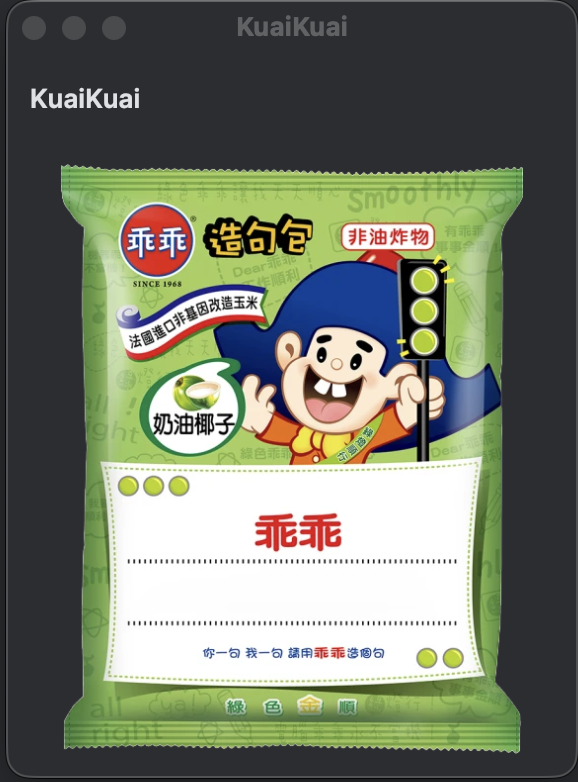

# KuaiKuai

<!-- Plugin description -->
KuaiKuai (乖乖) is a JetBrains IDE plugin that displays the iconic 乖乖 snack image — a beloved lucky charm in Taiwanese programmer culture. The snack is traditionally placed on top of servers and computers to keep them running smoothly.

The plugin shows the 乖乖 image in a side tool window anchored to the right of your IDE, bringing good luck to your development environment.  

If you don't know, here's the [Wikipedia](https://en.wikipedia.org/wiki/Kuai_Kuai_culture) about it.

## Screenshot

<!-- Plugin description end -->

## Installation

- Using IDE built-in plugin system:

  <kbd>Settings/Preferences</kbd> > <kbd>Plugins</kbd> > <kbd>Marketplace</kbd> > <kbd>Search for "KuaiKuai"</kbd> >
  <kbd>Install Plugin</kbd>

- Manually:

  Download the [latest release](https://github.com/cytsai1008/KuaiKuai/releases/latest) and install it manually using
  <kbd>Settings/Preferences</kbd> > <kbd>Plugins</kbd> > <kbd>⚙️</kbd> > <kbd>Install plugin from disk...</kbd>

---

Disclaimer: 乖乖 and KuaiKuai and logos are trademarks of Kuai Kuai Co., Ltd. This plugin is an unofficial fan project and is not affiliated with or endorsed by Kuai Kuai Co., Ltd.

---
Plugin based on the [IntelliJ Platform Plugin Template][template].

[template]: https://github.com/JetBrains/intellij-platform-plugin-template

---
## TODO
- [ ] Add settings page to allow users to choose different 乖乖 images or custom images.
- [ ] Add an option to toggle when failed, shows the red 乖乖 image.